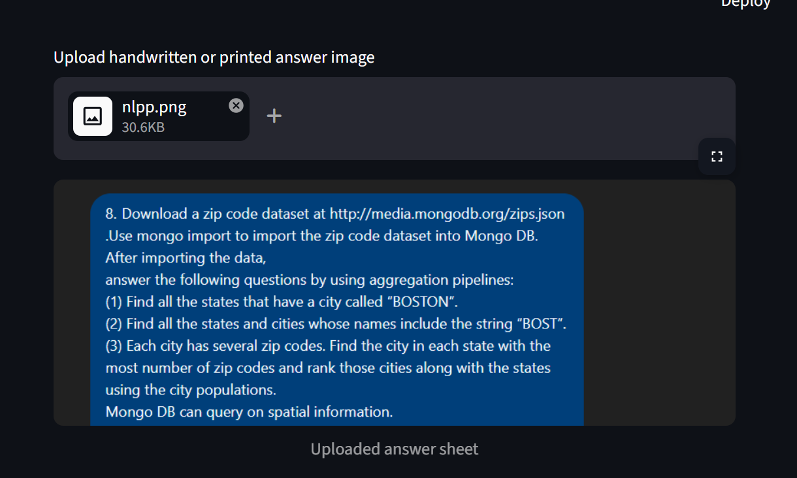
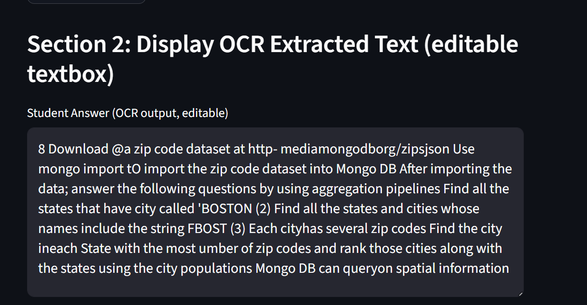

# NLP-Based Exam Evaluator (Lightweight Version)

This project evaluates any exam answer dynamically. It does not depend on a fixed question set.

The workflow is:

1. Upload a handwritten or printed answer sheet image.
2. Extract text with EasyOCR.
3. Correct the OCR text manually if needed.
4. Paste a reference answer copied from Google, the internet, or a textbook.
5. Optionally paste the actual question text.
6. Evaluate the student answer against the pasted reference answer.

## Active Project Structure

```text
Exam_evaluatornlp/
├── app.py
├── config.py
├── ocr/
│   └── extractor.py
├── nlp/
│   ├── embeddings.py
│   ├── keyword_matcher.py
│   └── similarity.py
├── scoring/
│   └── evaluator.py
├── feedback/
│   └── generator.py
└── utils/
    └── preprocessing.py
```

## Features

- EasyOCR-based text extraction for uploaded answer sheets
- Editable OCR output before evaluation
- Dynamic reference answer input through copy-paste
- Optional question input for stronger topic alignment
- Semantic similarity using `all-MiniLM-L6-v2`
- TF-IDF keyword coverage
- Missing keyword detection
- Short feedback generation
- Configurable marks
- Answer length penalty
- CPU-first design with cached OCR and embedding models

## Install

```powershell
cd "Exam_evaluatornlp"
pip install -r requirements.txt
```

## Run

```powershell
streamlit run app.py
```

If you prefer the compatibility entrypoint:

```powershell
streamlit run streamlit_app.py
```

## Inputs

- Student answer image
- OCR-corrected student text
- Reference answer pasted manually
- Optional question text

## Outputs

- Semantic similarity percentage
- Keyword match score
- Final marks
- Missing keyword suggestions
- Improvement feedback
- Keyword highlighting

## Workflow Screens

The following screenshots explain the full answer-evaluation workflow clearly for demonstration and mentor review.

### Step 1: Upload Answer Sheet Image

In this step, the user uploads the handwritten or printed answer-sheet image into the Streamlit application.



### Step 2: OCR Extraction and Editable Student Text

In this step, the system extracts the student answer using OCR and displays the text inside an editable textbox so that OCR mistakes can be corrected manually before evaluation.



### Step 3: Compare with Reference Answer and Generate Score

In this step, the system compares the extracted student answer with the pasted reference answer and produces the final score, keyword analysis, and feedback.


## Notes

- The app is designed for CPU-only systems.
- EasyOCR is lighter than large OCR transformer pipelines, but first-time model loading will still take time.
- Accuracy depends on OCR quality and the quality of the pasted reference answer.
- The nested `nlpfinal/` folder contains older prototype code and is not the active app path.
